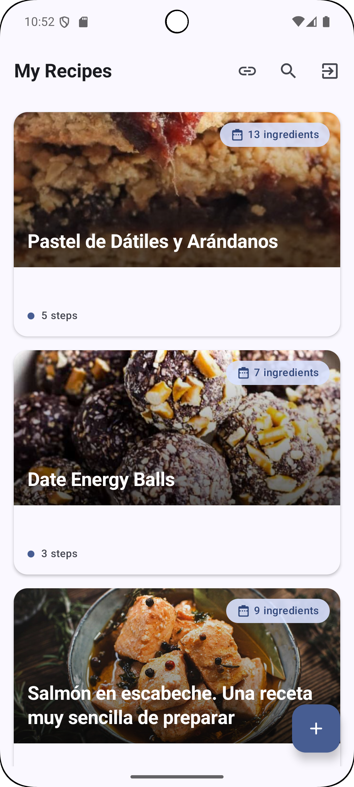

# Recipe App

## Overview

This Android application allows users to manage and discover recipes. It connects to a powerful backend service that leverages a Large Language Model (LLM) to extract recipe details from any provided web URL.

## Features

*   **User Authentication:** Secure login and logout functionality.
*   **Secure Token Management:** Access tokens are encrypted using Tink and stored securely in Jetpack DataStore.
*   **Recipe Discovery:** Browse a list of available recipes.
*   **Recipe Extraction via URL:** Add new recipes by simply providing a web URL. The backend LLM intelligently extracts the recipe information.
*   **Local Caching:** Fetched recipes are cached locally using Room for offline access and faster loading.
*   **Robust Error Handling:** Gracefully handles authentication errors, such as expired tokens, by redirecting to the login screen.
*   **Clear Navigation:** Intuitive navigation between login, recipe list, and recipe detail screens.
*   **Backend Integration:** Communicates with a custom backend (running on `http://10.0.2.2:8000` for emulator/device access to host's localhost) for recipe data and extraction services.
*   **Cleartext Traffic Enabled:** Network security configuration allows HTTP traffic to `10.0.2.2` for development purposes.
*   **Unit Tests:** Core functionalities like ViewModels, UseCases, and TokenStorage are unit-tested using JUnit 5 and MockK.

## Tech Stack (Frontend - Android)

*   Kotlin
*   Jetpack Compose for UI
*   Hilt for Dependency Injection
*   Ktor Client for networking
*   Room for local database
*   Jetpack DataStore for preferences/token storage
*   Tink for encryption
*   Coroutines for asynchronous operations
*   ViewModel and StateFlow for UI state management
*   JUnit 5 & MockK for testing

## Backend

The application relies on a separate backend service which provides:
*   API endpoints for user authentication (`/token`).
*   API endpoints for fetching and managing recipes.
*   An advanced feature to extract recipe details (ingredients, instructions, etc.) from any given web URL using a Large Language Model (LLM).

## How to Use Recipe Extraction

The app integrates with a backend that can extract recipe information from a website. While the UI for directly inputting a URL might still be under development, the underlying capability involves sending a URL to a backend endpoint, which then uses an LLM to parse the recipe content.

## Known Information & Context

Based on previous development:
*   The app has undergone package structure refactoring for Hilt compatibility.
*   Logout functionality and navigation back to login screen are implemented.
*   Hardcoded strings have been moved to `strings.xml`.
*   A `MainViewModel` handles initial splash/loading logic to check for existing tokens.
*   The `saveRecipes` method in `RoomRecipeDataSource` ensures recipes are cached, though with a known limitation that `RecipeLinkEntity` might not store full details.
